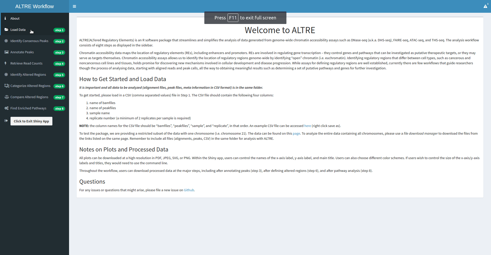

# ALTRE R Package

[](https://gitter.im/ProjectALTRE/Lobby?utm_source=badge&utm_medium=badge&utm_campaign=pr-badge&utm_content=badge)

[](https://travis-ci.org/Mathelab/ALTRE)
[](https://ci.appveyor.com/project/Mathelab/altre/branch/master)
[](https://codecov.io/gh/Mathelab/ALTRE)


## Install From Github


To install ALTRE, run the following code in the R terminal

```{R}
# Install Bioconductor packages (dependencies)            
source("http://bioconductor.org/biocLite.R")
BiocInstaller::biocLite(c('org.Hs.eg.db',
                          'EnsDb.Hsapiens.v75',
                          'GO.db'))
                        
# Install the devtools package for installing ALTRE
install.packages("devtools") 
# Install the ALTRE package 
devtools::install_github("mathelab/ALTRE")
```

If you encounter an error when runing these 4 lines, please do the following:

On Linux and Mac OS
=======

When installing on Linux, installation might fail if the XML package cannot be installed. Installation failure  can be fixed by installing the libxml2, an XML C parser for Linux. Also to install the devtools R library, you also need to install several system dependencies. On Ubuntu this can be done by running the following line in the terminal:

```{R}
sudo apt-get install libxml2-dev libssl-dev libcurl4-openssl-dev gfortran
```
On Mac OS, the same dependecies can installed using the *brew* command. 


On Windows
=======

if you get an installation error then first run the following lines of code in the R console:

```{R}
install.packages(c("htmltools","httpuv","evaluate","markdown"))


## Installation Walk-through Animation


### To Run

To launch the Shiny app inside R, run

```{R}
library(ALTRE)
runShinyApp()
```
#### Shiny App How to Run


#### Shiny App Preview




##Vignette 

A vignette (which provides an overview of the package via step-by-step guide through an example dataset) is here:
https://mathelab.github.io/ALTRE/vignette.html

## Data

A restricted subset of the data with one chromosome (i.e. chromosome 21) can be found on this [page](http://mathelab.github.io/ALTREsampledata/). The corresponding CSV file for input into ALTRE can be downloaded [here](https://raw.githubusercontent.com/mathelab/ALTREsampledata/master/DNaseEncodeExample.csv). Be sure that the CSV file and the data files are in the same folder when running analysis with ALTRE.

To download the entire data, please use a file download manager to download the files from the links listed below. 

### Alignment (in BAM format) files:

#### *A549*:
https://www.encodeproject.org/files/ENCFF001CLE/@@download/ENCFF001CLE.bam

https://www.encodeproject.org/files/ENCFF001CLJ/@@download/ENCFF001CLJ.bam
 
#### *SAEC*:
https://www.encodeproject.org/files/ENCFF001EFI/@@download/ENCFF001EFI.bam

https://www.encodeproject.org/files/ENCFF001EFN/@@download/ENCFF001EFN.bam

### Peak/hotspot (in BED format) files:

#### *A549*: 
http://hgdownload.cse.ucsc.edu/goldenPath/hg19/encodeDCC/wgEncodeUwDnase/wgEncodeUwDnaseA549HotspotsRep1.broadPeak.gz

http://hgdownload.cse.ucsc.edu/goldenPath/hg19/encodeDCC/wgEncodeUwDnase/wgEncodeUwDnaseA549HotspotsRep2.broadPeak.gz


#### *SAEC*:
http://hgdownload.cse.ucsc.edu/goldenPath/hg19/encodeDCC/wgEncodeUwDnase/wgEncodeUwDnaseSaecHotspotsRep1.broadPeak.gz

http://hgdownload.cse.ucsc.edu/goldenPath/hg19/encodeDCC/wgEncodeUwDnase/wgEncodeUwDnaseSaecHotspotsRep2.broadPeak.gz

### Blacklisted genomic regions for functional genomics analysis

https://sites.google.com/site/anshulkundaje/projects/blacklists


